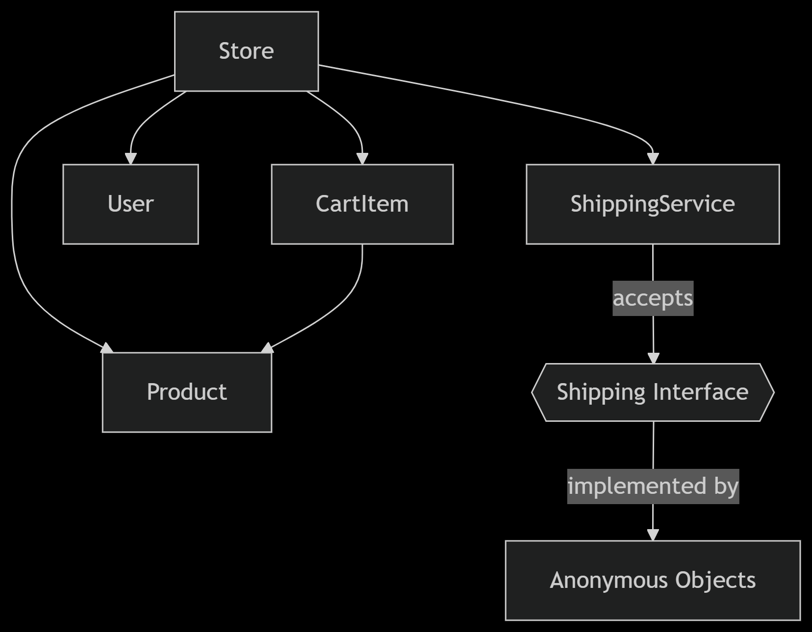

# FawryTask
#  Object-Oriented Design in the E-Commerce System

This document outlines how **Object-Oriented Programming (OOP)** principles and patterns are applied in the implementation of a simplified e-commerce system.

---

## 🔑 Core OOP Principles Applied

---

### 1. **Encapsulation**

Each class encapsulates its own data and behaviors:

- Internal state is scoped within constructor functions
    
- External access is controlled via method interfaces
    

**Example: `Product` class**

```tsx
function Product(id, name, price, stock, expires, needsShip, weight) {
    this.id = id;
    this.name = name;
    this.price = price;
    this.stock = stock;
    this.expires = expires;
    this.needsShip = needsShip;
    this.weight = weight;
}

```

> No getters/setters are used for simplicity; all properties are accessed directly.

---

### 2. **Abstraction**

Complex operations are hidden behind simple interfaces:

- `Store.checkout()` encapsulates:
    
    - Validation
        
    - Payment deduction
        
    - Shipping coordination
        
    - Receipt generation
        

```tsx
Store.prototype.checkout = function () {
    // All checkout steps are abstracted here
};
```


---

### 3. **Inheritance**

JavaScript uses **prototypal inheritance** for method sharing:

- Constructor functions serve as classes
    
- Shared methods are attached to their `.prototype`
    

**Example:**

```tsx
function User(name, balance) {
    this.name = name;
    this.balance = balance;
}

User.prototype.deductBalance = function (amount) {
    if (amount > this.balance) throw new Error("Insufficient funds");
    this.balance -= amount;
};
```


---

### 4. **Polymorphism**

`ShippingService` expects all shipping items to have the same **interface**:

- Methods: `getName()` and `getWeight()`
    
- Different products implement these implicitly through anonymous objects
    

```tsx
function ShippingService() {
    this.shipItems = function (shippableItems) {
        shippableItems.forEach(item => {
            console.log(`${item.getName()} - ${item.getWeight()}g`);
        });
    };
}
```

---

## 🧱 Class Responsibilities

---

### 1. **Product**

Represents a sellable item.

- **Attributes:** `id`, `name`, `price`, `stock`, `expires`, `needsShip`, `weight`
    
- **Behavior:** None (data-holder only)
    

---

### 2. **CartItem**

Holds a product-quantity pair in the cart.

- **Attributes:** `product`, `quantity`
    
- **Behavior:** None
    

---

### 3. **User**

Represents a customer.

- **Attributes:** `name`, `balance`
    
- **Behavior:**
    
    - `deductBalance(amount)`: Validates and reduces balance
        

---

### 4. **ShippingService**

Handles shipping logistics.

- **Behavior:**
    
    - `shipItems(items)`: Logs shipping details of items with `getName()` and `getWeight()` methods
        

---

### 5. **Store (Main Controller)**

Coordinates the entire e-commerce workflow.

- **Attributes:**
    
    - Product catalog
        
    - Cart
        
    - User
        
    - Shipping service
        
- **Behaviors:**
    
    - Display products
        
    - Add/remove from cart
        
    - Checkout
        
    - Manage inventory
        
    - Generate receipt
        

---

## 🧩 Key OOP Patterns

---

### 1. **Constructor Pattern**

Used to define classes:

```tsc
function Product(id, name, price, stock, expires, needsShip, weight) {
    this.id = id;
    // ...
}
```

---

### 2. **Prototype Pattern**

Used to share methods between instances:

```tsx
Store.prototype.addToCart = function(productId) {
    // Implementation
};
```
---

### 3. **Facade Pattern**

`Store` acts as a facade to simplify interactions:

```tsx
store.addToCart('p1', 2);
store.checkout();
```
---

### 4. **Observer Pattern (Implied)**

DOM events respond to user interactions:

```tsx
button.addEventListener('click', () => store.addToCart('p1'));
```

---

## 🔁 Object Collaboration Diagram


---

## 📐 SOLID Principles Applied

---

### 1. **Single Responsibility Principle (SRP)**

Each class handles one specific role:

- `ShippingService`: only responsible for shipping
    
- `User`: only handles balance
    

---

### 2. **Open/Closed Principle (OCP)**

System can be extended with new product types, shipping rules, or payment methods without modifying existing code.

---

### 3. **Liskov Substitution Principle (LSP)**

All products that need shipping implement the expected interface:

- Each has `getName()` and `getWeight()` for shipping purposes
    

---

### 4. **Interface Segregation Principle (ISP)**

`ShippingService` depends only on `getName()` and `getWeight()` — no unnecessary methods.

---

### 5. **Dependency Inversion Principle (DIP)**

- `Store` (high-level) depends on an **abstraction** (`getName()` / `getWeight()`)
    
- `ShippingService` (low-level) consumes those abstractions
    

---

## 🎯 Benefits of the OOP Design

- ✅ **Modularity** – Small components with focused roles
    
- ✅ **Maintainability** – Code is clean and easy to update
    
- ✅ **Extensibility** – New features or products can be added easily
    
- ✅ **Reusability** – Classes like `ShippingService` can be reused elsewhere
    
- ✅ **Scalability** – Architecture supports growth in features and complexity
    
